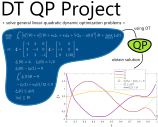

## README (dt-qp-project)

[](https://github.com/danielrherber/dt-qp-project/releases/latest)
[](https://www.mathworks.com/products/matlab.html)
[](https://github.com/danielrherber/dt-qp-project/issues)
[](https://github.com/danielrherber/dt-qp-project/graphs/contributors)

[](https://github.com/danielrherber/dt-qp-project/blob/master/License)

This project solves linear-quadratic dynamic optimization (LQDO) problems using direct transcription (DT) and quadratic programming (QP)



---
### Install
* Download the [DT QP Project](https://github.com/danielrherber/dt-qp-project/archive/master.zip)
* Run [INSTALL_DTQP_Project.m](INSTALL_DTQP_Project.m) to automatically add the project files to your MATLAB path, download the required files, and open an example
```matlab
INSTALL_DTQP_Project
```
* See [DTQP_template.m](examples/DTQP_template.m) for some examples illustrating how to implement different linear-quadratic dynamic optimization (LQDO) problem elements using the structure-based syntax of the DT QP Project
```matlab
help DTQP_template
```
* See [BrysonHo166.m](examples/bryson-ho-166/BrysonHo166.m) for an example with problem setup and options
```matlab
open BrysonHo166
```

### Citation
Please cite the following two items if you use the DT QP Project:
* DR Herber. *Advances in Combined Architecture, Plant, and Control Design.* PhD Dissertation, University of Illinois at Urbana-Champaign, Urbana, IL, USA, Dec. 2017. [[bibtex]](http://systemdesign.illinois.edu/~systemdesign/bibtexbrowser.php?key=Herber2017e&bib=esdl_refs.bib) [[pdf]](http://systemdesign.illinois.edu/publications/Her17e.pdf)
	- *Discuss the theory behind this project and contains a number of examples comparing the different methods.*
* DR Herber, YH Lee, JT Allison. *DT QP Project*, GitHub. url: [https://github.com/danielrherber/dt-qp-project](https://github.com/danielrherber/dt-qp-project)

### External Includes
See [INSTALL_DTQP_Project.m](INSTALL_DTQP_Project.m) for more information.
- MATLAB File Exchange Submission IDs (**8773, 40397, 23629, 43183**)
- [http://dmpeli.math.mcmaster.ca/Matlab/Math4Q3/Lecture2-1/LagrangeInter.m](http://dmpeli.math.mcmaster.ca/Matlab/Math4Q3/Lecture2-1/LagrangeInter.m)
- [http://www1.spms.ntu.edu.sg/~lilian/bookcodes/legen/lepoly.m](http://www1.spms.ntu.edu.sg/~lilian/bookcodes/legen/lepoly.m)

---
### General Information

#### Contributors
- [Daniel R. Herber](https://github.com/danielrherber) (primary)
- [Yong Hoon Lee](https://github.com/yonghoonlee)
- James T. Allison

#### Project Links
- [https://github.com/danielrherber/dt-qp-project](https://github.com/danielrherber/dt-qp-project)
- [https://www.mathworks.com/matlabcentral/fileexchange/XXXXX](https://www.mathworks.com/matlabcentral/fileexchange/XXXXX)