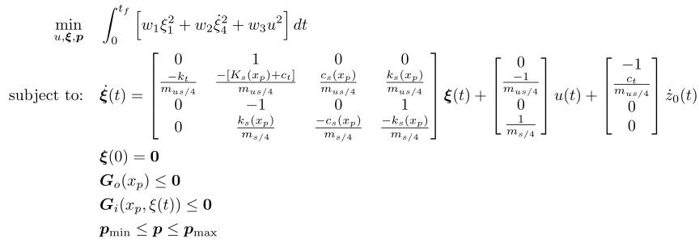

## Detailed Suspension Control Co-Design Problem

  

### Key Files

##### Simultaneous Strategy

- For a single problem instance with the simultaneous CCD strategy, run 
- For many problems with different options (tolerances, number of time points, derivative methods, etc.) with the simultaneous CCD strategy, run 

##### Nested Strategy

- For a single problem instance with the nested CCD strategy, run 
- For many problems with different options (tolerances, number of time points, derivative methods, etc.) with the nested CCD strategy, run 

### Reference

##### Code and results for the following reference:

A. K. Sundarrajan and D. R. Herber, "*Towards a Fair Comparison Between the Nested and Simultaneous Control Co-Design Methods Using an Active Suspension Case Study*", American Control Conference, May 2021

##### Original reference:

J. T. Allison, T. Guo, and Z. Han, "*Co-Design of an Active Suspension Using Simultaneous Dynamic Optimization*", Journal of Mechanical Design, vol. 136, no. 8, Jun. 2014, doi: 10.1115/1.4027335. [Online]. Available: http://dx.doi.org/10.1115/1.4027335 

### Formulation

  

Note that this formulation is for the simultaneous problem. The nested strategy (inner/outer loops with fixed plant design for the inner-loop problem) is also implemented as indicated above.

<!-- ### Solution -->