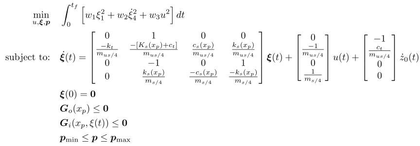

## Detailed Suspension

### Reference
J. T. Allison, T. Guo, and Z. Han, "*Co-Design of an Active Suspension Using Simultaneous Dynamic Optimization*", Journal of Mechanical Design, vol. 136, no. 8, Jun. 2014, doi: 10.1115/1.4027335. [Online]. Available: http://dx.doi.org/10.1115/1.4027335

### Formulation

<!-- ### Solution -->