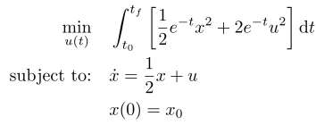

## Anderson Moore 64

### Reference
p. 64 of B. D. O. Anderson and J. B. Moore, *Optimal Control: Linear Quadratic Methods*. Prentice-Hall, 1989, isbn: 0136386512.

### Formulation

### Solution
A closed-form solution is available for this problem at the reference above.