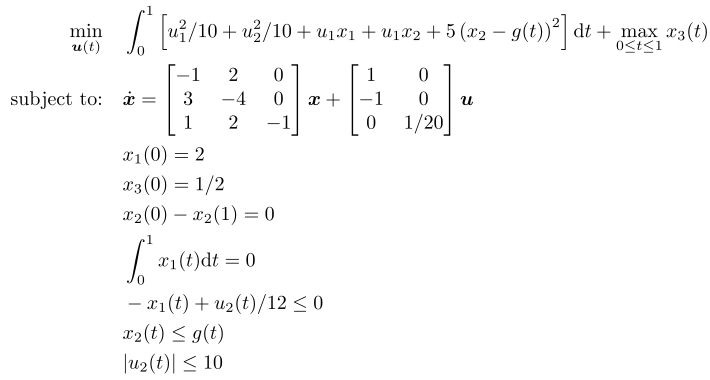

## DT QP 1

### Reference
pp. 130-131 of D. R. Herber. *Advances in Combined Architecture, Plant, and Control Design.* PhD Dissertation, University of Illinois at Urbana-Champaign, Urbana, IL, USA, Dec. 2017.

### Formulation

### Solution
There is currently no exact solution.