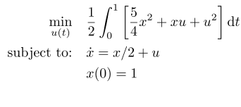

## Hager 1

### Reference
W. W. Hager, Runge-Kutta Methods in Optimal Control and the Transformed Adjoint System," *Numerische Mathematik*, vol. 87, no. 2, pp. 247-282, Dec. 2000. doi: 10.1007/s002110000178

### Formulation

### Solution
A closed-form solution is available for this problem at the reference above.