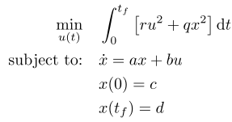

## LQR Scalar Transfer

### Reference
- A special case of this problem is in H. P. Geering, "Optimal Control with Engineering Applications", Springer, 2007, pp. 46-48, doi: 10.1007/978-3-540-69438-0
- With certain problem parameters, this problem has similar behavior to the "Hyper-Sensitive" problem in A. V. Rao and K. D. Mease, Eigenvector Approximate Dichotomic Basis Methods for Solving Hyper-Sensitive Optimal Control Problems, Optimal Control Applications and Methods, Vol. 21, No. 1., January-February, 2000, pp. 1-17.

### Formulation

### Solution
A closed-form solution is available for this problem.