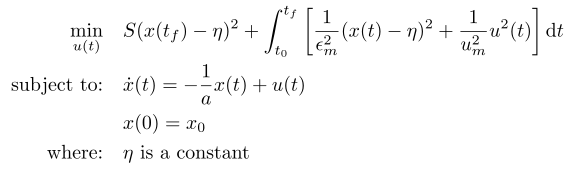

## Turner Chun Juang 1

### Reference
Example 6.1 of J. D. Turner, H. M. Chun, J. N. Juang, "Closed-Form Solutions for a Class of Optimal Quadratic Tracking Problems", Journal of Optimization Theory and Applications, vol. 47, no. 4, pp. 465-481, Dec. 1985, doi: 10.1007/BF00942192

### Formulation

### Solution
A closed-form solution is available for this problem at the reference above.