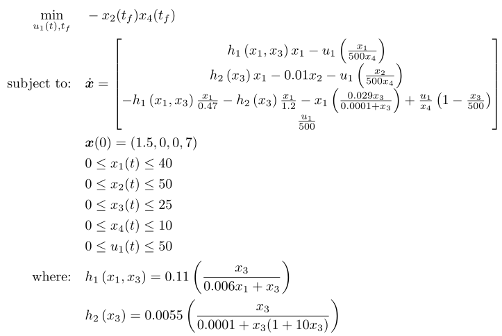

## Batch Fermentor Penicillin

### Reference
Case Study I in J. R. Banga, E. Balsa-Canto, C. G. Moles, and A. A. Alonso, "*Dynamic optimization of bioprocesses: Efficient and robust numerical strategies*", Journal of Biotechnology, vol. 117, no. 4, pp. 407–419, Jun. 2005, doi: 10.1016/j.jbiotec.2005.02.013. [Online]. Available: http://dx.doi.org/10.1016/j.jbiotec.2005.02.013

### Formulation
