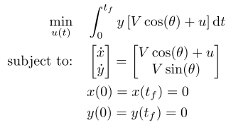

## Bryson-Ho 63

### Reference
p. 63 of A. E. Bryson Jr. and Y.-C. Ho, *Applied Optimal Control*. Taylor & Francis, 1975, isbn: 9780891162285

### Formulation

### Solution
A partial closed-form solution is available for this problem at the reference above.