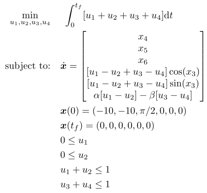

## Free Flying Robot

### Reference
326-330 of J. T. Betts, "*Practical Methods for Optimal Control and Estimation Using Nonlinear Programming*." Society for Industrial and Applied Mathematics, Jan. 2010, doi: 10.1137/1.9780898718577

### Formulation

<!-- ### Solution -->