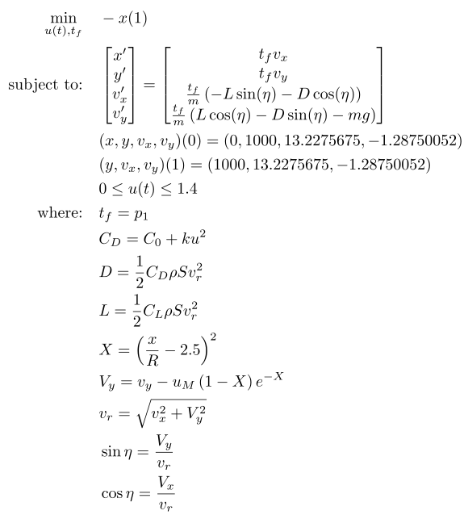

## Hang Glider

### Reference
R. Bulirsch, E. Nerz, H. J. Pesch, and O. von Stryk, "*Combining Direct and Indirect Methods in Optimal Control: Range Maximization of a Hang Glider,*" in Optimal Control, Birkhäuser Basel, 1993, pp. 273–288 [Online]. Available: http://dx.doi.org/10.1007/978-3-0348-7539-4_20

### Formulation

<!-- ### Solution -->