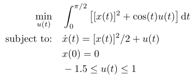

## Neuenhofen Kerrigan X1

### Reference
X1 from M. P. Neuenhofen and E. C. Kerrigan, "An integral penalty-barrier direct transcription method for optimal control," 2020, *arXiv*:2009.06217

### Formulation

<!-- ### Solution -->