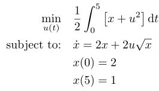

## Nonlinear 1D

### Reference
D. Garg et al., "*"Direct Trajectory Optimization and Costate Estimation of General Optimal Control Problems Using a Radau Pseudospectral Method*", in AIAA Guidance, Navigation, and Control Conference, 2009, doi: 10.2514/6.2009-5989 [Online]. Available: http://dx.doi.org/10.2514/6.2009-5989

### Formulation

<!-- ### Solution -->