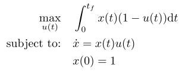

## Optimal Consumption

### Reference
pp. 51-52 of L. C. Evans, *An Introduction to Mathematical Optimal Control Theory*. Department of Mathematics, University of California, Berkeley, Version 0.2

### Formulation

### Solution
A closed from solution is available for this problem at the reference above.