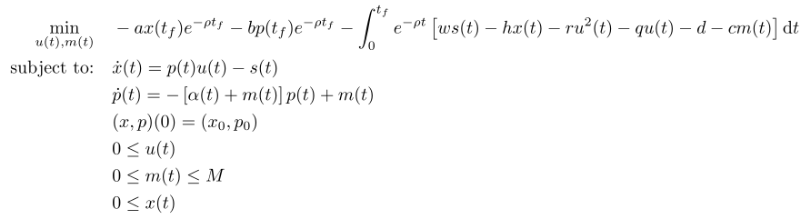

## Optimal Production and Maintenance

### Reference
D. I. Cho, P. L. Abad, and M. Parlar, "*Optimal production and maintenance decisions when a system experience age-dependent deterioration*", Optim. Control Appl. Meth., vol. 14, no. 3, pp. 153–167, Jul. 1993, doi: 10.1002/oca.4660140302. [Online]. Available: http://dx.doi.org/10.1002/oca.4660140302

### Formulation

<!-- ### Solution -->