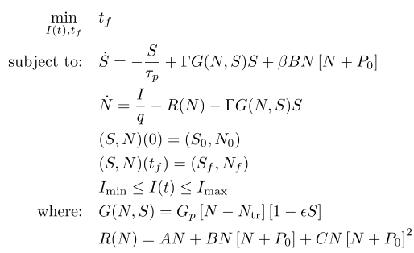

## Semiconductor Laser

### Reference
J.-H. R. Kim, G. L. Lippi, and H. Maurer, "*Minimizing the transition time in lasers by optimal control methods*", Physica D: Nonlinear Phenomena, vol. 191, no. 3–4, pp. 238–260, May 2004, doi: 10.1016/j.physd.2003.12.002. [Online]. Available: http://dx.doi.org/10.1016/j.physd.2003.12.002

### Formulation

<!-- ### Solution -->