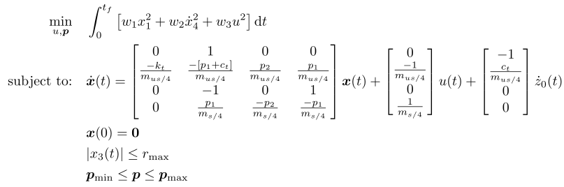

## Simple Suspension

### Reference
D. R. Herber and A. K. Sundarrajan, "*On the uses of linear-quadratic methods in solving nonlinear dynamic optimization problems with direct transcription*", in ASME International Mechanical Engineering Congress & Exposition, 2020

### Formulation

<!-- ### Solution -->