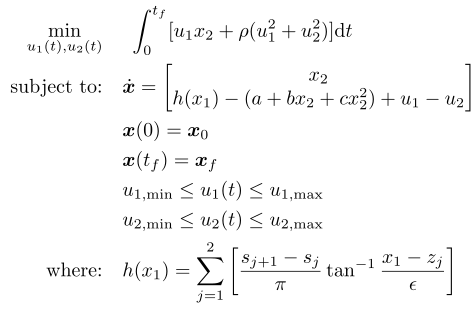

## Train

### Reference
R. J. Vanderbei, "*Case Studies in Trajectory Optimization: Trains, Planes, and Other Pastimes*," Optimization and Engineering, vol. 2, no. 2, pp. 215-243, 2001, doi: 10.1023/a:1013145328012

### Formulation

<!-- ### Solution -->