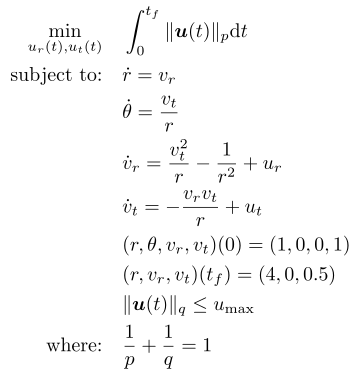

## Transfer - Minimum Fuel

### Reference
I. M. Ross, Q. Gong, and P. Sekhavat, "*Low-Thrust, High-Accuracy Trajectory Optimization*," Journal of Guidance, Control, and Dynamics, vol. 30, no. 4, pp. 921–933, Jul. 2007, doi: 10.2514/1.23181

### Formulation
