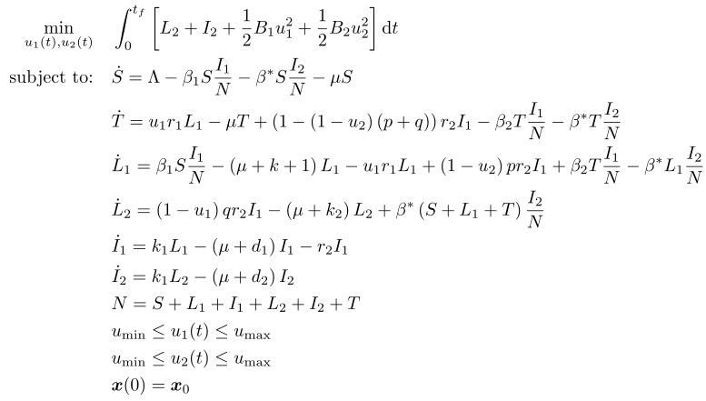

## Tuberculosis

### Reference
Sec. 6.16 in J. T. Betts, *Practical Methods for Optimal Control and Estimation Using Nonlinear Programming*. SIAM, 2010, isbn: 9780898716887

### Formulation

<!-- ### Solution -->