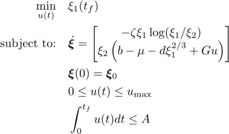

## Tumor

### Reference
U. Ledzewicz and H. Schättler, "Analysis of optimal controls for a mathematical model of tumour anti‐angiogenesis", *Optim. Control Appl. Meth.*, vol. 29, pp. 41-57, 2008, doi:10.1002/oca.814

### Formulation

<!-- ### Solution -->